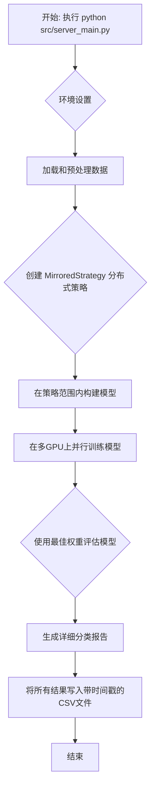
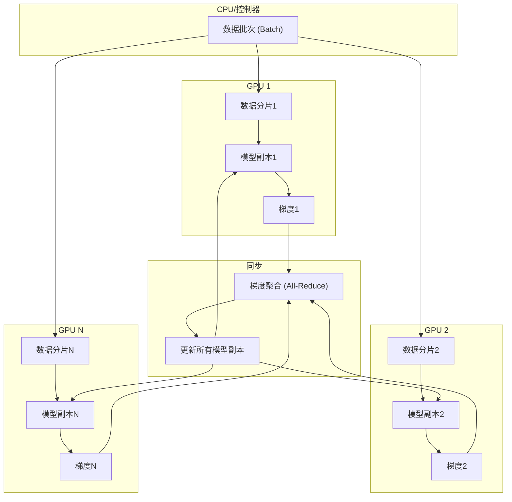

# 微博情感分析 LSTM 模型 - 服务器端训练与部署指南

本文档详细介绍了如何在配备有多块 NVIDIA GPU 的服务器上，高效地进行微博情感分析 LSTM 模型的训练、评估与结果记录。

---

## 1. 快速开始

### 1.1 环境要求

- **硬件**: 1 或多块 NVIDIA GPU
- **软件**:
  - Conda (或 Miniconda)
  - Git
  - CUDA Toolkit & cuDNN (需与 TensorFlow 版本兼容)

### 1.2 环境设置与安装

请按照以下步骤设置运行环境：

1. **克隆项目代码**

    ```bash
    git clone <your-repository-url>
    cd weibo-sentiment-analysis-lstm
    ```

2. **创建并激活 Conda 虚拟环境**
    我们使用 `requirements-gpu.txt` 文件来确保环境的一致性。

    ```bash
    # 创建一个名为 "weibo-sentiment-analysis-lstm-py310" 的新环境
    conda create --name weibo-sentiment-analysis-lstm-py310 python=3.10 -y

    # 激活新创建的环境
    conda activate weibo-sentiment-analysis-lstm-py310

    # 安装所有依赖
    pip install -r requirements-gpu.txt
    ```

3. **准备数据 (如果需要)**
    请确保您的数据集 `all_utf8.csv` 或 `weibo_senti_100k.csv` 位于 `data/input/` 目录下。脚本会自动查找并使用这些文件。

### 1.3 执行训练与评估

本项目已将训练、评估和报告流程整合到单一脚本中，以确保结果的准确性和一致性。

**在激活虚拟环境后，只需运行以下命令即可启动完整流程：**

```bash
python src/server_main.py
```

该命令将自动执行以下所有步骤：

- 使用所有可用的 GPU 进行分布式训练。
- 训练完成后，使用在验证集上表现最好的模型，立即在测试集上进行评估。
- 将详细的训练和评估结果（包括最佳 Epoch 指标、最终测试指标和分类报告）保存到 `data/output/` 目录下的一个带时间戳的 CSV 文件中。

---

## 2. 核心优化与改进详解

### 2.1 一体化工作流与可追溯性

- **统一脚本**: 将训练和评估流程合并到 `src/server_main.py` 中。这彻底解决了因模型保存/加载在特定环境下（尤其是分布式策略下）可能出现的状态丢失问题，确保了评估的模型与内存中性能最佳的模型是同一个。
- **自动化报告**: 训练结束后，脚本会自动将本次运行的所有关键结果（包括最佳验证集指标、最终测试集指标、每个类别的精确率/召回率/F1分数等）汇总，并保存到一个 **带时间戳的 CSV 文件** (`data/output/training_report_YYYYMMDD_HHMMSS.csv`) 中。这为实验结果的比较和追踪提供了极大的便利。

**工作流程图:**


### 2.2 分布式训练 (Multi-GPU Training)

- **策略**: 采用 TensorFlow 的 `tf.distribute.MirroredStrategy` 实现数据并行。该策略会将模型复制到每一个可用的 GPU 上，并将每个批次(batch)的数据平均分配给所有 GPU 进行并行计算，最后将所有 GPU 的梯度同步更新，从而显著缩短训练时间。
- **自动扩展**:
  - **全局批次大小 (Global Batch Size)**: 脚本会自动检测可用的 GPU 数量，并计算全局批次大小 (`global_batch_size = per_gpu_batch_size * num_gpus`)。
  - **学习率缩放 (Learning Rate Scaling)**: 采用业界通用的**线性缩放规则**，根据 GPU 数量动态调整目标学习率 (`target_lr = base_lr * sqrt(num_gpus)`)，这有助于在大批量训练时保持模型的稳定收敛。

**分布式训练示意图:**


### 2.3 健壮的模型架构 (Robust Model Architecture)

- **深度网络**: 使用了双层 LSTM 结构，以增强模型对序列数据复杂模式的捕捉能力。
- **正则化**:
  - **Batch Normalization**: 在每个 LSTM 层后都加入了批归一化层。它能够规范化层的输入，极大地稳定了训练过程，加快了收敛速度，并具有一定的正则化效果。
  - **Dropout**: 在 LSTM 层和全连接层后加入了 Dropout，在训练时随机"丢弃"一部分神经元，有效防止了模型过拟合。
  - **L2 正则化**: 对所有 LSTM 和 Dense 层的权重（kernel）都施加了 L2 正则化，惩罚过大的权重值，进一步提升了模型的泛化能力。

**模型架构图:**
```mermaid
graph TD
    Input[输入文本序列] --> Embedding;
    subgraph "LSTM Block 1"
        Embedding --> LSTM1[LSTM (units=128, return_sequences=True)];
        LSTM1 --> BN1[Batch Normalization];
        BN1 --> Dropout1[Dropout (rate=0.3)];
    end
    subgraph "LSTM Block 2"
        Dropout1 --> LSTM2[LSTM (units=64)];
        LSTM2 --> BN2[Batch Normalization];
        BN2 --> Dropout2[Dropout (rate=0.3)];
    end
    subgraph "Classifier"
        Dropout2 --> Dense1[Dense (units=32, activation='relu')];
        Dense1 --> BN3[Batch Normalization];
        BN3 --> Dropout3[Dropout (rate=0.3)];
    end
    Dropout3 --> Output[Dense (units=2, activation='softmax')];
```

### 2.4 先进学习率调度 (Advanced Learning Rate Scheduling)

- **策略**: 实现了自定义的 `WarmupCosineDecay` 学习率调度器。
  - **预热 (Warmup)**: 在训练初期，学习率会从一个较小的值线性增长到预设的目标值。这个"预热"阶段可以帮助模型在训练初期更加稳定，避免因学习率过大导致模型"震荡"。
  - **余弦衰减 (Cosine Decay)**: 预热结束后，学习率会按照余弦函数曲线平滑地下降。相比于传统的阶梯式下降，这种方式能让模型在训练后期更好地探索损失函数的局部最优解。

### 2.5 高效数据处理与内存管理

- **高效输入流**: 使用 `tf.data.Dataset` API 来构建数据输入管道，并通过 `.prefetch(tf.data.AUTOTUNE)` 让数据预处理和模型训练可以并行进行，避免了 GPU 等待数据造成的性能瓶颈。
- **GPU 内存动态增长**: 在脚本开始时设置 `tf.config.experimental.set_memory_growth(gpu, True)`，让 TensorFlow 按需申请 GPU 显存，而不是一次性占用全部显存。这使得在同一台服务器上运行多个任务成为可能，提升了资源的利用率。

---

## 3. 性能与结果展示

### 3.1 训练性能总结

以下是多次在7卡 RTX 4090 服务器上运行的性能总结，展示了模型训练的高度稳定性和一致性。

| 运行编号 | 最佳验证集准确率 | 最终测试集准确率 | 训练总耗时 (秒) |
| :------: | :--------------: | :--------------: | :-------------: |
|    1     |      0.9835      |      0.9842      |       327       |
|    2     |      0.9812      |      0.9814      |       329       |
|    3     |      0.9831      |    *未记录*    |       321       |
|    4     |      0.9827      |    *未记录*    |       341       |

*注：早期版本的脚本未集成最终评估，但其验证集准确率已证明了模型的有效性。*

### 3.2 结果输出示例

以下是某次成功运行后，脚本输出的关键结果。

**终端日志中的分类报告:**
```log
2025-06-22 21:25:18.279 | ... | INFO | ... | 最终评估 - 分类报告:
2025-06-22 21:25:18.279 | ... | INFO | ... |               precision    recall  f1-score   support
2025-06-22 21:25:18.279 | ... | INFO | ... |
2025-06-22 21:25:18.279 | ... | INFO | ... |           积极     0.9979    0.9706    0.9840      5843
2025-06-22 21:25:18.279 | ... | INFO | ... |           消极     0.9712    0.9979    0.9844      5805
2025-06-22 21:25:18.279 | ... | INFO | ... |
2025-06-22 21:25:18.279 | ... | INFO | ... |     accuracy                         0.9842     11648
2025-06-22 21:25:18.280 | ... | INFO | ... |    macro avg     0.9845    0.9842    0.9842     11648
2025-06-22 21:25:18.280 | ... | INFO | ... | weighted avg     0.9846    0.9842    0.9842     11648
```

**自动生成的 CSV 报告文件内容 (`data/output/training_report_20250622_214524.csv`):**

```csv
timestamp,best_epoch,best_val_loss,best_val_accuracy,best_val_precision,best_val_recall,final_test_loss,final_test_accuracy,final_test_precision,final_test_recall,report_积极_precision,report_积极_recall,report_积极_f1-score,report_积极_support,report_消极_precision,report_消极_recall,report_消极_f1-score,report_消极_support,report_accuracy,report_macro_avg_precision,report_macro_avg_recall,report_macro_avg_f1-score,report_macro_avg_support,report_weighted_avg_precision,report_weighted_avg_recall,report_weighted_avg_f1-score,report_weighted_avg_support
2025-06-22 21:45:24,13,0.06798,0.98120,0.98120,0.98120,0.0667,0.9814,0.9814,0.9814,0.9973,0.9654,0.9811,5843,0.9663,0.9974,0.9816,5805,0.9814,0.9818,0.9814,0.9814,11648,0.9819,0.9814,0.9814,11648
```
