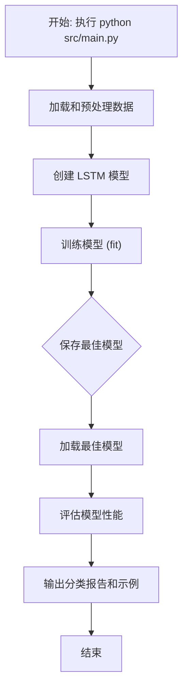
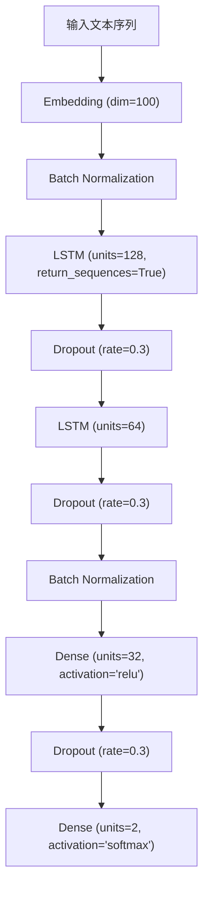

# 微博情感分析系统

基于LSTM的微博文本情感分析系统，实现了文本的二分类（积极/消极）功能。

## 项目结构

```
weibo-sentiment-analysis-lstm/
├── data/
│   ├── input/          # 输入数据目录
│   │   ├── all.csv     # 原始数据
│   │   └── all_utf8.csv# UTF-8编码的数据
│   ├── output/         # 输出数据目录
│   │   ├── word_dict.pk    # 字符映射字典
│   │   ├── label_dict.pk   # 标签映射字典
│   │   └── lstm_model.keras   # 训练好的模型
│   └── output_backup/  # 输出备份目录
├── src/
│   ├── __init__.py
│   ├── config.py       # 配置文件
│   ├── logger.py       # 日志配置
│   ├── main.py        # 单机版主程序
│   ├── server_main.py # 服务器版主程序
│   ├── server_config.py # 服务器配置
│   ├── process.py     # 数据处理和可视化
│   └── train_and_evaluation.py # 模型训练和评估
├── tests/             # 单元测试目录
├── docs/             # 文档目录
├── requirements.txt   # 基础依赖
└── requirements-gpu.txt # GPU环境依赖
```

## 数据处理流程

### 1. 数据加载和预处理 (`load_data` 函数)

#### 输入

- `filepath`: CSV文件路径 (data/input/all_utf8.csv)
- `input_shape`: 输入序列长度 (默认20，实际使用180)

#### 处理步骤

1. **数据读取**
   - 输入：UTF-8编码的CSV文件
   - 输出：包含评论文本(evaluation)和情感标签(label)的DataFrame

2. **标签和词汇提取**
   - 输入：DataFrame
   - 输出：
     - `labels`: 唯一标签列表 ['消极', '积极']
     - `vocabulary`: 唯一评论文本列表

3. **字符级特征构建**
   - 输入：评论文本列表
   - 输出：字符集合（unique characters）

4. **映射字典构建**
   - 输出：
     - `word_dictionary`: 字符到索引的映射
     - `inverse_word_dictionary`: 索引到字符的映射
     - `label_dictionary`: 标签到索引的映射
     - `output_dictionary`: 索引到标签的映射

5. **字典文件保存**
   - 输出位置：`data/output/`目录
     - `word_dict.pk`: 字符映射字典
     - `label_dict.pk`: 标签映射字典

6. **序列处理**
   - 输入：原始评论文本
   - 输出：填充后的数字序列矩阵
   - 处理：将每条评论转换为固定长度的数字序列

7. **标签处理**
   - 输入：原始标签
   - 输出：one-hot编码的标签矩阵

#### 最终输出

- `x`: 处理后的输入特征矩阵
- `y`: one-hot编码的标签矩阵
- `output_dictionary`: 用于预测时转换回原始标签
- `vocab_size`: 词汇表大小
- `label_size`: 标签类别数
- `inverse_word_dictionary`: 用于预测时转换回原始字符

### 2. 模型结构 (`create_lstm` 函数)

#### 输入参数

- `n_units`: LSTM层神经元个数
- `input_shape`: 输入序列长度
- `output_dim`: Embedding层输出维度
- `filepath`: 数据文件路径

#### 模型架构

1. **Embedding层**
   - 功能：将字符索引转换为密集向量
   - 参数：
     - input_dim: 词汇表大小 + 1
     - output_dim: 指定的输出维度
     - input_length: 序列长度
     - mask_zero: True（支持变长序列）

2. **LSTM层**
   - 功能：处理序列数据
   - 参数：
     - units: 神经元个数
     - input_shape: (batch_size, sequence_length)

3. **Dropout层**
   - 功能：防止过拟合
   - 参数：rate = 0.2

4. **Dense层**
   - 功能：输出分类结果
   - 参数：
     - units: 标签类别数
     - activation: 'softmax'

#### 输出

- 编译好的Keras模型
- 模型结构图（保存为`model_lstm.png`）

### 3. 模型训练 (`model_train` 函数)

#### 输入参数

- `input_shape`: 输入序列长度
- `filepath`: 数据文件路径
- `model_save_path`: 模型保存路径

#### 训练过程

1. 加载和预处理数据
2. 划分训练集和测试集（比例9:1）
3. 训练模型：
   - batch_size: 32
   - epochs: 5
   - optimizer: adam
   - loss: categorical_crossentropy

#### 输出

- 保存的模型文件 (lstm_model.h5)
- 测试集上的预测结果和准确率

## 使用说明

1. 安装依赖：

```bash
pip install -r requirements.txt
```
2. 运行程序：

```bash
./start.sh
```

## 数据要求

输入CSV文件需要包含以下列：

- `evaluation`: 评论文本
- `label`: 情感标签（'积极' 或 '消极'）

## 环境要求

- Python 3.10
- CUDA支持（可选，用于GPU加速）
- 足够的内存（建议8GB以上）

## 注意事项

1. 确保输入数据为UTF-8编码
2. 模型参数可在 `train_and_evaluation.py` 中调整
3. 可视化结果会自动保存在输出目录

## Docker运行说明

### 方式一：直接使用预构建镜像

```bash
# 拉取最新版本镜像
docker pull ghcr.io/你的GitHub用户名/weibo-sentiment-analysis-lstm:latest

# 创建必要的目录
mkdir -p data/input data/output logs/tensorboard

# 运行容器
docker run -v $(pwd)/data:/app/data -v $(pwd)/logs:/app/logs ghcr.io/你的GitHub用户名/weibo-sentiment-analysis-lstm:latest
```

### 方式二：本地构建（参考上面的Docker运行说明）

## 版本发布流程

1. 创建新的版本标签：

```bash
git tag -a v1.0.0 -m "发布1.0.0版本"
git push origin v1.0.0
```

2. 推送标签后，GitHub Actions会自动：
   - 构建Docker镜像
   - 发布到GitHub Container Registry
   - 生成以下标签：
     - `v1.0.0`：完整版本号
     - `v1.0`：主次版本号
     - `latest`：最新版本

3. 镜像构建完成后，可以在GitHub Packages中查看：
   - 访问 `https://github.com/你的用户名/weibo-sentiment-analysis-lstm/pkgs/container/weibo-sentiment-analysis-lstm`

# 微博情感分析 LSTM 模型 - 单机训练指南

本文档为项目的标准 README，详细介绍了如何在**单机环境（CPU 或单张 GPU）**下，进行微博情感分析 LSTM 模型的训练与评估。

> 针对多 GPU 服务器环境的部署与优化，请参考 `README-SERVER.md`。

---

## 1. 快速开始

### 1.1 环境要求

- **硬件**: 普通 PC 或带单张 GPU 的工作站
- **软件**:
  - Conda (或 Miniconda)
  - Git

### 1.2 环境设置与安装

1. **克隆项目代码**

    ```bash
    git clone <your-repository-url>
    cd weibo-sentiment-analysis-lstm
    ```

2. **创建并激活 Conda 虚拟环境**

    ```bash
    # 创建一个名为 "weibo-sentiment-analysis-lstm-py310" 的新环境
    conda create --name weibo-sentiment-analysis-lstm-py310 python=3.10 -y

    # 激活新创建的环境
    conda activate weibo-sentiment-analysis-lstm-py310

    # 安装所有依赖
    # 如果您有 NVIDIA GPU，请确保已安装对应的 CUDA Toolkit，然后安装 tensorflow-gpu
    # pip install tensorflow-gpu
    pip install -r requirements.txt
    ```

3. **准备数据**
    请确保您的数据集 (`all_utf8.csv` 或 `weibo_senti_100k.csv`) 位于 `data/input/` 目录下。

### 1.3 执行训练

**在激活虚拟环境后，运行以下命令即可启动训练和评估流程：**

```bash
# `src/main.py` 是为单机环境设计的入口
python src/main.py
```

---

## 2. 工作流程与模型架构

### 2.1 工作流程

脚本 `src/main.py` (内部调用 `src/train_and_evaluation.py` 的逻辑) 将会执行一个完整的端到端任务，具体流程如下：



### 2.2 模型架构

单机版模型经过精心设计，以在有限的计算资源下获得良好的性能。其具体结构如下：



- **Embedding 层**: 将输入的字符索引转换为密集的词向量。
- **Batch Normalization**: 在输入到 LSTM 前进行批归一化，稳定数据分布。
- **双层 LSTM**: 两层 LSTM 堆叠，用于捕捉文本中的长距离依赖关系和复杂的序列模式。
- **Dropout**: 在 LSTM 和全连接层后加入，以防止模型过拟合。
- **Dense 层**: 最终通过一个带有 Softmax 激活函数的全连接层输出分类概率。

